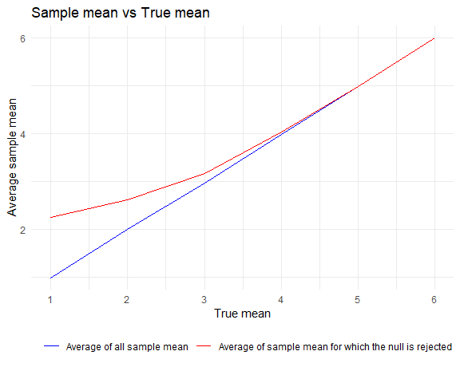

p8105_hw5_jz3902
================
Jinghan Zhao
2024-11-09

## Problem 1

``` r
bdays_sim = function(n){

  bdays = sample(1:365, size = n, replace = TRUE)
  
  duplicate = length(unique(bdays)) < n

  return(duplicate)
  
}
```

``` r
bdays_sim_result = 
  expand_grid(
    n = 2:50,
    iter = 1:10000
  ) %>% 
  mutate(result = map_lgl(n, bdays_sim)) %>% 
  group_by(n) %>% 
  summarize(prob = mean(result))

bdays_sim_result %>% 
  ggplot(aes(x = n, y = prob)) +
  geom_line() +
  labs(
    title = "Birthday problem",
    x = "Group size",
    y = "Probability",
    caption = "The probability that at least two people in the group will share a birthday.")
```


- After 10,000 simulations for each group size, the plot of probability
  vs group size is close to a curve. When the group size exceeds 23, the
  probability that at least two people in the group will share the same
  birthday becomes greater than 50%.

## Problem 2

### Function

``` r
t_sim = function(samp_size = 30, true_mean, true_sd = 5) {
  
  sim_df = 
    tibble(
    x = rnorm(samp_size, true_mean, true_sd)
  )
  
  out_df = 
    sim_df %>% 
    t.test() %>% 
    broom::tidy() %>% 
    select(estimate, p.value) %>% 
    mutate(reject_or_not = p.value < 0.05)
    
  return(out_df)
  
}
```

### For $\mu = 0$

``` r
t_mu0_result = 
  expand_grid(
    true_mean = 0,
    iter = 1:5000
    ) %>% 
  mutate(
    output = map(true_mean, \(x) t_sim(true_mean = x))
    ) %>% 
  unnest(output)

head(t_mu0_result)
```

    ## # A tibble: 6 × 5
    ##   true_mean  iter estimate p.value reject_or_not
    ##       <dbl> <int>    <dbl>   <dbl> <lgl>        
    ## 1         0     1   1.44    0.105  FALSE        
    ## 2         0     2   0.568   0.590  FALSE        
    ## 3         0     3  -0.0533  0.948  FALSE        
    ## 4         0     4  -1.87    0.0616 FALSE        
    ## 5         0     5   0.184   0.831  FALSE        
    ## 6         0     6   1.55    0.132  FALSE

### For $\mu = {1,2,3,4,5,6}$

``` r
t_repeat_result = 
  expand_grid(
    true_mean = c(1:6),
    iter = 1:5000
    ) %>% 
  mutate(
    output = map(true_mean, \(x) t_sim(true_mean = x))
    ) %>% 
  unnest(output)
```

``` r
t_repeat_result %>% 
  group_by(true_mean) %>% 
  summarize(reject_prob = mean(reject_or_not)) %>% 
  ggplot(aes(x = true_mean, y = reject_prob)) +
  geom_line() +
  scale_x_continuous(breaks = 1:6)+
  labs(
    title = "Power vs True mean",
    x = "True mean",
    y = "Power of the test",
    caption = "The proportion of times the null was rejected (the power of the test).")
```


- As the true mean increases, the number of rejections of the null
  hypothesis increases, that is, the power of the test increases and
  approaches 1.

``` r
t_repeat_result %>% 
  group_by(true_mean) %>% 
  summarize(avg_estimate = mean(estimate),
            avg_rej_estimate = mean(estimate[reject_or_not == TRUE])) %>% 
  ggplot() +
  geom_line(aes(x = true_mean, y = avg_estimate, color = "line1")) +
  geom_line(aes(x = true_mean, y = avg_rej_estimate, color = "line2")) +
  scale_x_continuous(breaks = 1:6) +
  labs(
    title = "Sample mean vs True mean",
    x = "True mean",
    y = "Average sample mean",
    color = " "
    ) +
  scale_color_manual(
    values = c("line1" = "blue", "line2" = "red"),                 
    labels = c("Average of all sample mean",
               "Average of sample mean for which the null is rejected")  
  )
```



- When the true mean $\mu$ is small, the average of sample mean
  $\hat{\mu}$ for which the null is rejected **is not equal to** the
  true value of $\mu$. This is because $\mu$ is close to the null
  hypothesis, so the generated datasets will have a greater probability
  of having $\hat{\mu}$ close to the null hypothesis. If the null
  hypothesis is rejected, $\hat{\mu}$ needs to be far enough away from
  the null hypothesis (and $\mu$ that is close to it).

- Similarly, as $\mu$ increases, the proportion of all samples that
  reject the null hypothesis increases, and the average of $\hat{\mu}$
  that reject the null hypothesis will get closer and closer to $\mu$
  **until they are equal**.

## Problem 3

``` r
homicide_df = 
  read_csv("data/homicide-data.csv") %>% 
  mutate(city_state = str_c(city, state, sep = ", "))

head(homicide_df)
```

    ## # A tibble: 6 × 13
    ##   uid   reported_date victim_last victim_first victim_race victim_age victim_sex
    ##   <chr>         <dbl> <chr>       <chr>        <chr>       <chr>      <chr>     
    ## 1 Alb-…      20100504 GARCIA      JUAN         Hispanic    78         Male      
    ## 2 Alb-…      20100216 MONTOYA     CAMERON      Hispanic    17         Male      
    ## 3 Alb-…      20100601 SATTERFIELD VIVIANA      White       15         Female    
    ## 4 Alb-…      20100101 MENDIOLA    CARLOS       Hispanic    32         Male      
    ## 5 Alb-…      20100102 MULA        VIVIAN       White       72         Female    
    ## 6 Alb-…      20100126 BOOK        GERALDINE    White       91         Female    
    ## # ℹ 6 more variables: city <chr>, state <chr>, lat <dbl>, lon <dbl>,
    ## #   disposition <chr>, city_state <chr>

- There are 52179 observations and 13 variables in the homicide dataset.

### Summarize

``` r
summarize_homi_df = 
homicide_df %>%
  group_by(city_state) %>% 
  distinct(uid, disposition) %>% 
  summarize(
    total_homi = n(),
    unsolved_homi = sum(disposition %in% c("Closed without arrest", "Open/No arrest"))
  )

head(summarize_homi_df)
```

    ## # A tibble: 6 × 3
    ##   city_state      total_homi unsolved_homi
    ##   <chr>                <int>         <int>
    ## 1 Albuquerque, NM        378           146
    ## 2 Atlanta, GA            973           373
    ## 3 Baltimore, MD         2827          1825
    ## 4 Baton Rouge, LA        424           196
    ## 5 Birmingham, AL         800           347
    ## 6 Boston, MA             614           310

### Unsolved homicide in Baltimore

``` r
prop_test_baltimore = 
  summarize_homi_df %>% 
  filter(city_state == "Baltimore, MD") %>%
  { prop.test(x = .$unsolved_homi, n = .$total_homi) }

prop_test_baltimore %>% 
  broom::tidy() %>% 
  select(estimate, conf.low, conf.high)
```

    ## # A tibble: 1 × 3
    ##   estimate conf.low conf.high
    ##      <dbl>    <dbl>     <dbl>
    ## 1    0.646    0.628     0.663

- This is the table of estimated proportion and confidence interval of
  unsolved homicides in Baltimore, MD.

### Repeat for each city

``` r
test_city = function(homi_info) {
  
  out_df = 
  homi_info %>% 
    { prop.test(x = .$unsolved_homi, n = .$total_homi) } %>% 
    broom::tidy() %>% 
    select(estimate, conf.low, conf.high)
  
  return(out_df)
  
}

homi_prop_df = 
  summarize_homi_df %>%
  nest(data = total_homi:unsolved_homi) %>% 
  mutate(
    test_result = map(data, \(x) test_city(homi_info = x))
    ) %>% 
  select(-data) %>% 
  unnest(test_result)

head(homi_prop_df)
```

    ## # A tibble: 6 × 4
    ##   city_state      estimate conf.low conf.high
    ##   <chr>              <dbl>    <dbl>     <dbl>
    ## 1 Albuquerque, NM    0.386    0.337     0.438
    ## 2 Atlanta, GA        0.383    0.353     0.415
    ## 3 Baltimore, MD      0.646    0.628     0.663
    ## 4 Baton Rouge, LA    0.462    0.414     0.511
    ## 5 Birmingham, AL     0.434    0.399     0.469
    ## 6 Boston, MA         0.505    0.465     0.545

- This is part of the table for the proportion of unsolved homicides in
  each city.

``` r
homi_prop_df %>% 
  mutate(city_state = fct_reorder(city_state, estimate)) %>% 
  ggplot(aes(x = city_state, y = estimate, color = city_state)) +
  geom_point() +
  geom_errorbar(aes(ymin = conf.low, ymax = conf.high)) +
  theme(legend.position = "none",
        axis.text.x = element_text(size = 8, angle = 90, hjust = 1)) +
  labs(
    title = "Proportion of unsolved homicides in each city",
    x = "City",
    y = "Estimate of proportion",
    caption = "The proportion of unsolved homicides and the confidence interval for each city."
    )
```


- For the city of Tulsa, AL, there is only one homicide for which the
  disposition is “Closed by arrest” (i.e. solved). Therefore, the
  proportion of unsolved homicides is estimated zero and the CI is wide
  due to lack of information.
