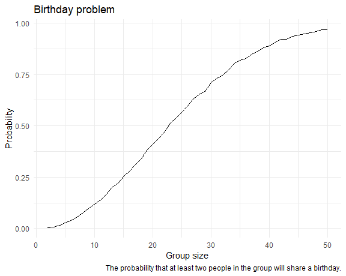
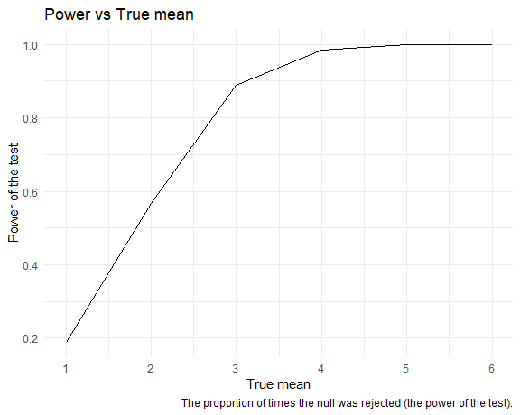

p8105_hw5_jz3902
================
Jinghan Zhao
2024-11-09

## Problem 1

``` r
bdays_sim = function(n){

  bdays = sample(1:365, size = n, replace = TRUE)
  
  duplicate = length(unique(bdays)) < n

  return(duplicate)
  
}
```

``` r
bdays_sim_result = 
  expand_grid(
    n = 2:50,
    iter = 1:10000
  ) %>% 
  mutate(result = map_lgl(n, bdays_sim)) %>% 
  group_by(n) %>% 
  summarize(prob = mean(result))

bdays_sim_result %>% 
  ggplot(aes(x = n, y = prob)) +
  geom_line() +
  labs(
    title = "Birthday problem",
    x = "Group size",
    y = "Probability",
    caption = "The probability that at least two people in the group will share a birthday.")
```



After 10,000 simulations for each group size, the plot of probability vs
group size is close to a curve. When the group size exceeds 23, the
probability that at least two people in the group will share the same
birthday becomes greater than 50%.

## Problem 2

### Function

``` r
t_sim = function(samp_size = 30, true_mean, true_sd = 5) {
  
  sim_df = 
    tibble(
    x = rnorm(samp_size, true_mean, true_sd)
  )
  
  out_df = 
    sim_df %>% 
    t.test() %>% 
    broom::tidy() %>% 
    select(estimate, p.value) %>% 
    mutate(reject_or_not = p.value < 0.05)
    
  return(out_df)
  
}
```

### For $\mu = 0$

``` r
t_mu0_result = 
  expand_grid(
    true_mean = 0,
    iter = 1:5000
    ) %>% 
  mutate(
    output = map(true_mean, \(x) t_sim(true_mean = x))
    ) %>% 
  unnest(output)

head(t_mu0_result)
```

    ## # A tibble: 6 × 5
    ##   true_mean  iter estimate p.value reject_or_not
    ##       <dbl> <int>    <dbl>   <dbl> <lgl>        
    ## 1         0     1   0.224   0.765  FALSE        
    ## 2         0     2   1.57    0.0840 FALSE        
    ## 3         0     3  -0.192   0.808  FALSE        
    ## 4         0     4   0.490   0.654  FALSE        
    ## 5         0     5   2.18    0.0437 TRUE         
    ## 6         0     6   0.0503  0.964  FALSE

### For $\mu = {1,2,3,4,5,6}$

``` r
t_repeat_result = 
  expand_grid(
    true_mean = c(1:6),
    iter = 1:5000
    ) %>% 
  mutate(
    output = map(true_mean, \(x) t_sim(true_mean = x))
    ) %>% 
  unnest(output)
```

``` r
t_repeat_result %>% 
  group_by(true_mean) %>% 
  summarize(reject_prob = mean(reject_or_not)) %>% 
  ggplot(aes(x = true_mean, y = reject_prob)) +
  geom_line() +
  scale_x_continuous(breaks = 1:6)+
  labs(
    title = "Power vs True mean",
    x = "True mean",
    y = "Power of the test",
    caption = "The proportion of times the null was rejected (the power of the test).")
```



As the true mean increases, the number of rejections of the null
hypothesis increases, that is, the power of the test increases and
approaches 1.

``` r
t_repeat_result %>% 
  group_by(true_mean) %>% 
  summarize(avg_estimate = mean(estimate),
            avg_rej_estimate = mean(estimate[reject_or_not == TRUE])) %>% 
  ggplot() +
  geom_line(aes(x = true_mean, y = avg_estimate, color = "line1")) +
  geom_line(aes(x = true_mean, y = avg_rej_estimate, color = "line2")) +
  scale_x_continuous(breaks = 1:6) +
  labs(
    title = "Sample mean vs True mean",
    x = "True mean",
    y = "Average sample mean",
    color = "Type"
    ) +
  scale_color_manual(
    values = c("line1" = "blue", "line2" = "red"),                 
    labels = c("Average of all sample mean",
               "Average of sample mean for which the null is rejected")  
  )
```


- When the true mean $\mu$ is small, the average of sample mean
  $\hat{\mu}$ for which the null is rejected **is not equal to** the
  true value of $\mu$. This is because $\mu$ is close to the null
  hypothesis, so the generated datasets will have a greater probability
  of having $\hat{\mu}$ close to the null hypothesis. If the null
  hypothesis is rejected, $\hat{\mu}$ needs to be far enough away from
  the null hypothesis (and $\mu$ that is close to it).
- Similarly, as $\mu$ increases, the proportion of all samples that
  reject the null hypothesis increases, and the average of $\hat{\mu}$
  that reject the null hypothesis will get closer and closer to $\mu$
  **until they are equal**.
